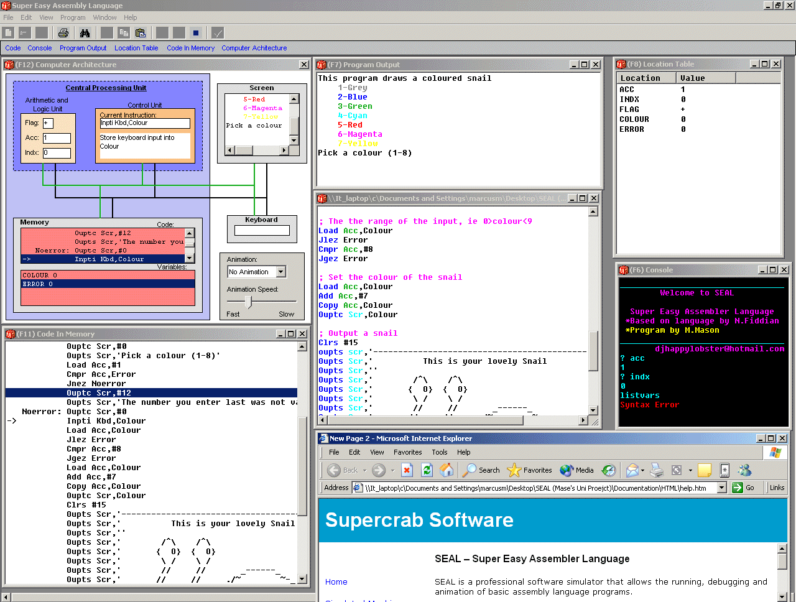

## SEAL

### Description

Complete assembly language emulator with colour syntaxing and animation. Use this software to write simple assembly language programs and actually watch the instructions execute in a virtual computer's architecture. Uses my own interpreter for decoding source code. Check it out the pic and download!
 
### More Info
 

             |
---                |---
**Submitted On**   |2004-02-18 14:48:22
**By**             |[Happy Lobster](https://github.com/Planet-Source-Code/PSCIndex/blob/master/ByAuthor/happy-lobster.md)
**Level**          |Advanced
**User Rating**    |5.0 (45 globes from 9 users)
**Compatibility**  |VB 6\.0
**Category**       |[Complete Applications](https://github.com/Planet-Source-Code/PSCIndex/blob/master/ByCategory/complete-applications__1-27.md)
**World**          |[Visual Basic](https://github.com/Planet-Source-Code/PSCIndex/blob/master/ByWorld/visual-basic.md)
**Archive File**   |[SEAL1712442232004\.zip](https://github.com/Planet-Source-Code/happy-lobster-seal__1-51844/archive/master.zip)

